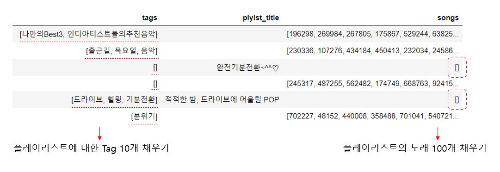

## 프로젝트명_ Melon Playlist Continuation

> 플레이리스트에 수록된 곡과 태그의 절반 또는 전부가 숨겨져 있을 때, 주어지지 않은 곡들과 태그를 예측하는 것을 목표로 합니다.

- [카카오아레나_Melon Playlist Continuation](https://arena.kakao.com/c/7)

## 프로젝트 목표

> 주어진 플레이리스트의 정보를 참조하여 해당 플레이리스트에 원래 수록되어 있었을 곡 리스트와 태그 리스트를 예측하는 것이 이 대회의 목표입니다.
>
> 각 플레이리스트별로 **원래 플레이리스트에 들어있었을 것이라 예상되는 곡 100개, 태그 10개를 만들어 주세요.**

## 개발 환경

- python 3.7.7

## 사용 라이브러리

- **Scientific Computation**

  - pandas

  - numpy

    

- **General DL/ML library/framework**

  - gensim

  - sklearn.neighbors

    

- **Text tokenize**

  - sentencepiece

- **Visualization/Interactive**

  - seaborn

  - matplotlib

    

## 활용 데이터

> 멜론 서비스에서 수집된 플레이리스트 데이터의 일부분
>
> [데이터 다운 링크](https://arena.kakao.com/c/7/data)

- 플레이리스트 메타데이터
  - 플레이리스트 제목
  - 플레이리스트에 수록된 곡
  - 플레이리스트에 달려있는 태그 목록
  - 플레이리스트 좋아요 수
  - 플레이리스트가 최종 수정된 시각
- 곡 메타데이터
  - 곡 제목
  - 앨범 제목
  - 아티스트명
  - 장르
  - 발매일

## 모델 간단 설명

- `Test Data`를 4가지 set으로 분리, 각 set 별 필요 항목을 채우는 모델링 구상

  | tag  | plylist_title | songs |
  | :--: | :-----------: | :---: |
  |...|" ... "|...|
  |**empty**|       "..."        |  ...  |
  |...|"..."|**empty**|
  |**empty**|"..."|**empty**|

- train, test data의 playlist에 수록되어있는 tag들을 확인한 결과, 상반되거나 상이한 의미를 가진 tag들이 묶인 것을 발견하여 tag보다 노래들을 먼저 채우고, 차후에 tag를 채우는 방향으로 진행하였다.

- *Train Data*의 노래와 *playlist에 등장한 tag 중 빈도수 top N*을 추출하여, `노래 - tag 데이터프레임`을 만든다. ( 해당 데이터 프레임으로, 별 노래는 태그 별 count mapping 벡터로 표현 )

- 위 데이터프레임과 `sklearn`의 `nearest neighbors` 알고리즘을 통해, 특정 노래와 유사한 노래 100개를 추출할 수 있다.

- 그리고 추출한 노래 100개에 대해, 공통적으로 포함하고 있는 tag 10개를 추측한다.

- 또한, `sentence piece`와 `word2vec`를 활용하여 playlist 이름만 있는 set의 노래와 tag를 채울 수 있는 단서를 만들었다.

- #### 데이터 전처리 부분을 수정하며, memory 부하를 발생시키지 않는 방향으로 위 과정을 반복 수행한다.

## 모델 실행 결과

> 곡과 태그의 정확도 지표는 nDCG를 사용한다. (참조, [DCG_Wiki](https://en.wikipedia.org/wiki/Discounted_cumulative_gain))

- 리더보드 제출 결과

| 곡 nDCG  | 태그 nDCG |
| -------- | --------- |
| 0.054032 | 0.314600  |

## 참고자료

- [데이터 전처리 & EDA](https://arena.kakao.com/forum/topics/191)

- [데이터 탐색](https://brunch.co.kr/@kakao-it/343)